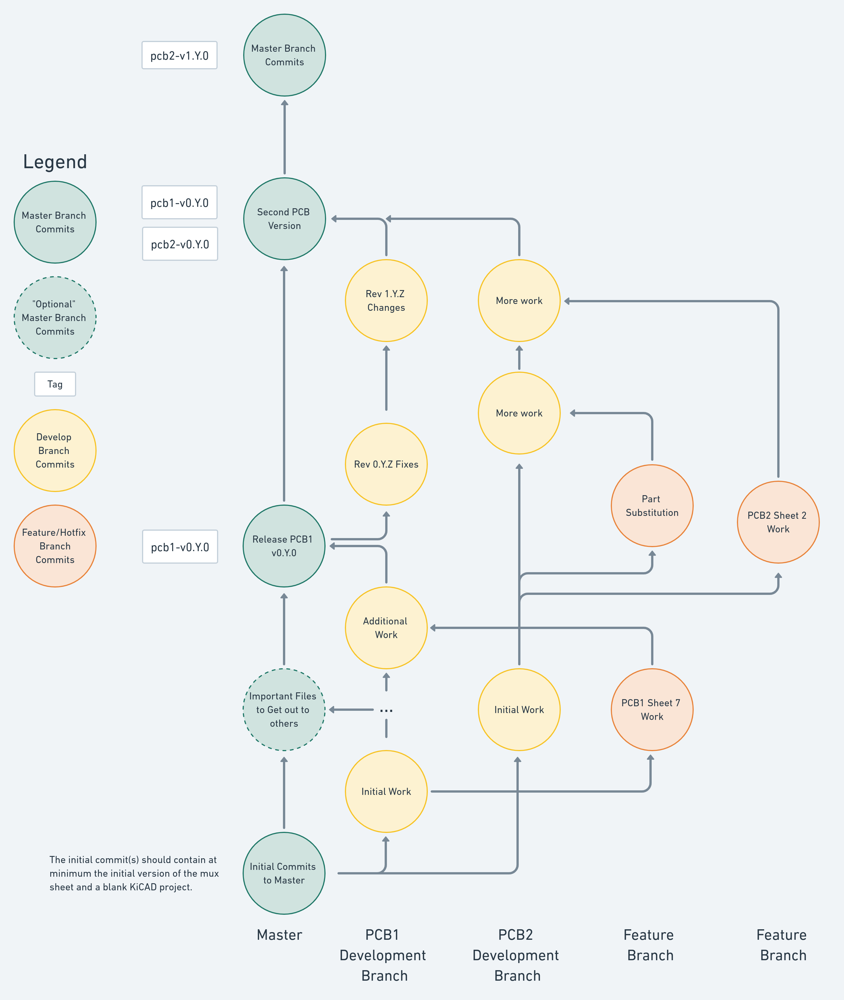

# Contributing to OpenVentilator

This process outlines the Git version control process utilized for the hardware portion of the OpenVentilator project.

## General Guidelines

Always work on your own branch and on your own schematic sheet(s) or sections of the board. If two engineers make changes to the same parts of the design, then Git may have trouble merging the changes together correctly.

Check with the board lead to ensure you are not doing overlapping work with another engineer.

## Clone the Repository

1. In the GitLab project, near the top right click **Clone**. If you set up an SSH key, then copy the link to clone with SSH. If you did not, then copy the link to clone with HTTPS.
2. In the command prompt (or the Git shell in Windows), navigate to where you would like to locally work on the project. Reach out for help in #how-to-get-started if you need help.
3. Issue a `git clone [insert clone link here]`.
4. Issue a `git checkout -b [insert branch name here]` to create and checkout your working branch.

## Parts Libraries

Be sure you properly configure your parts libraries to use the project specific libraries. See the [ReadMe.md](ReadMe.md) Parts section for more information.

## Branches

Be sure you are not working on the incorrect branch. Within the repository, type `git status` into the command prompt (or the Git shell on Windows) to validate this before beginning work.

Before beginning any new work or creating a new branch, you should ensure you have pulled the latest changes.

1. Checkout the appropriate branch. Issue `git checkout [insert branch name here]` into a Git shell.
2. Pull the latest changes with `git pull`.
3. Create a new branch using `git checkout -b [insert branch name here]`.

### Commits

Commit the work you are doing locally to your working branch regularly. This allows you to easily recover should you break something. Also, before signing off at the end of the day be sure to push your local changes up to the server. To commit and push your work:

1. Add changes to staging. Issue `git add .` to add all changes or `git add [specific filename 1] [specific filename 2] ...`.
2. Commit the work with a meaningful message. Issue `git commit -m "[Insert meaningful message here]"`.
3. Push your work to the server. Issue `git push`.

### Master

Commits to the master branch are "consumable" by other members of the team or by a manufacturer. For example, if you wanted to have just the BOM reviewed, you would issue a merge request specifically for the BOM.

### Development Branch

Each PCB should have its own development branch. The branch should be named such tthat it clearly indicates which PCB is being worked on. Preferably, the branch name should end in `-dev`.

### Feature/Hotfix Branch

A feature or hotfix branch should be used to work on a specific schematic sheet or section of the board. Be sure to include the parent branch name and append it with a meaningful label. For example, if working on sheet 7/9 then you could append `-sheet7` to the branch name.

## Merging

When your work has been completed, commit and push your work to the server. The next steps are determined below.

When a merge has been completed succesfully, it is recommended to delete the source branches both from the server and locally. This will help minimize clutter within the repository.

### Merge Requests

If you are ready to release files either to the team or to a manufacturer, use a merge request to merge the development branch into master.

Follow the steps [outlined here](https://docs.gitlab.com/ee/user/project/merge_requests/) to open a merge request. Be sure to click both the `Delete source branch when merge request is accepted.` and `Squash commits when merge request is accepted.` options.

### Local Merge

When you are ready to merge a feature branch into a development branch, locally you will want to perform the merge.

1. Checkout the local development branch. Issue `git checkout [pcb development branch name]`.
2. Pull down the latest changes. Issue `git pull`.
3. Merge in the feature/hotfix branch. Issue `git merge [feature/hotfix branch name]`.

If we are all careful with how we are working on different aspects of all of these boards, then this should be able to merge automatically. However, if you are stuck and would like some help please reach out in the **#how-to-get-started** channel.

## Chart

Below is a rough chart to try to help visualize everything going on in the process above. Keep in mind that the arrows indicate that there is a link between two given commits. Each circle represents a commit to one of the branches. This is a greatly simplified version of a rather complex process, so please ask any questions in #how-to-get-started on Slack help gain clarity.

## Contributing to Parts Libraries

When adding a new part to the libraries, create a new branch using the manufacturer's part number.
